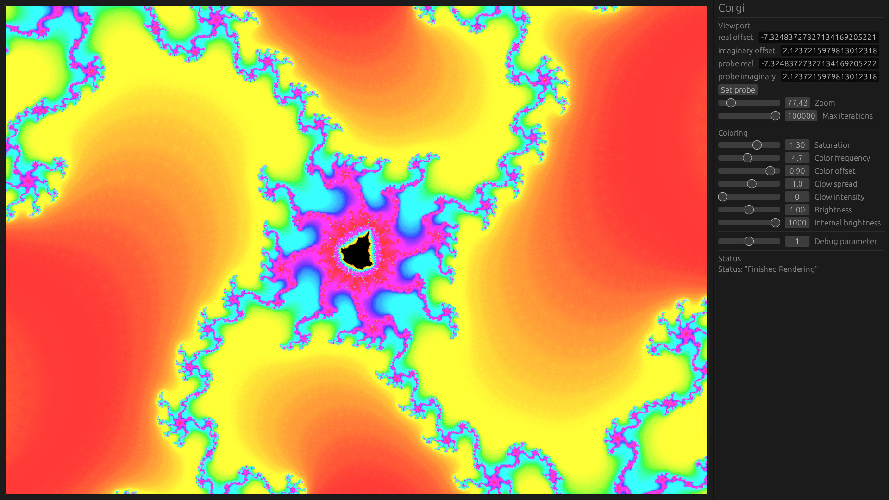

# Corgi

Corgi is a GPU-accelerated fractal rendering engine written in Rust that aims to be as performant as possible while maintaining a very high degree of precision. This allows for creating images at extremely high zoom levels (up to 2<sup>100</sup> times magnification).



## Features

- High precision rendering

Corgi uses a combination of arbitrary precision floating-point arithmetic and a perturbation-based formula to render views of the Mandelbrot set at up to 2^100 times magnification.

- GPU acceleration

The bulk of the computation is performed on the GPU, allowing for full utilization of your hardware.

- Fine-grained caching

Image rendering is performed in multiple steps to allow for caching of the most expensive computation. This means that modifications to settings used to color the image do not cause a full re-render, making style changes visible in real time.

### Planned Features

- Saving images to a file
- Fully customizable image coloring
- UI improvements
- Performance improvements
    - HIP/CUDA could be used as an alternative to compute shaders on supported hardware
    - Low-zoom images can be safely rendered GPU-only with the standard algorithm

## Usage

Currently, binary releases are not being created. However, you can compile Corgi from source by cloning the repository and running:

```bash
cargo run --release
```

You can then use the mouse and scroll wheel to explore the image, and the sliders on the side to adjust the image generation parameters. If you end up seeing noise or pixelation, use the "Probe Point" and select the point on the image closest to the interior of the Mandelbrot set (the part that has the most iterations). In the future this will be automatic.

The glow calculations also don't work reliably at high zoom levels, so you may need to set "Glow Intensity" to 0. This is also currently being worked on.

## Troubleshooting

If you the application fails to load, it likely encountered an issue during GPU initialization. Open up an issue, and I will see what I can do to support your machine. Currently, I have tested on both integrated and dedicated GPUs on the OpenGL and Vulkan backends.

To get more information about what is happening, you can set the `CORGI_LOG_LEVEL` environment variable:

```bash
# run with the highest level of detail
CORGI_LOG_LEVEL=TRACE cargo run --release
```
